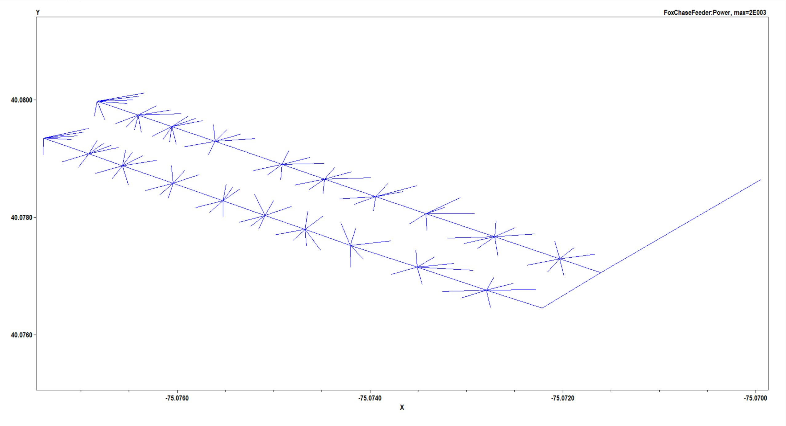
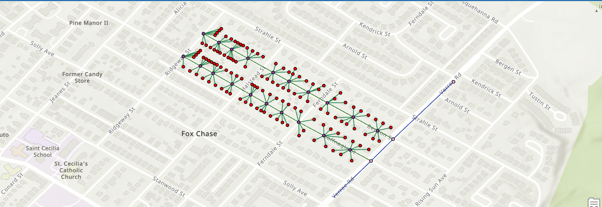
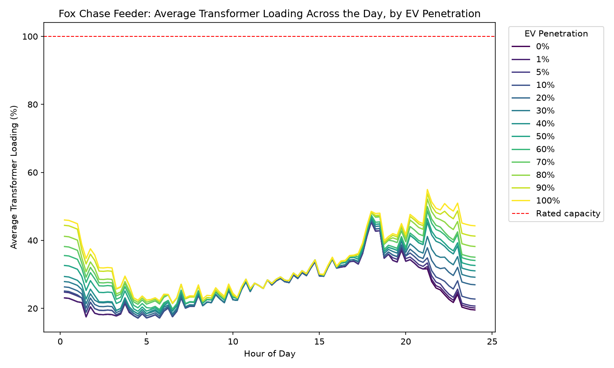
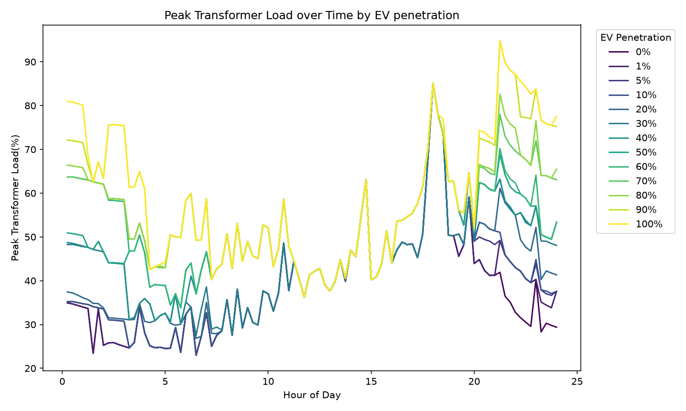
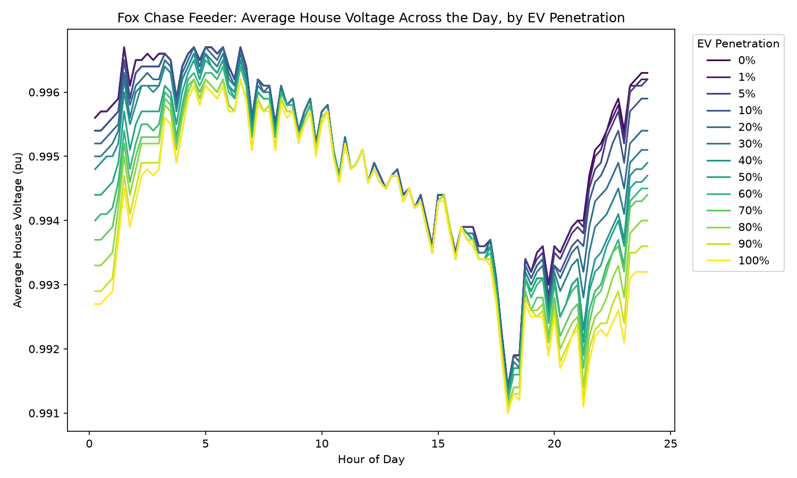
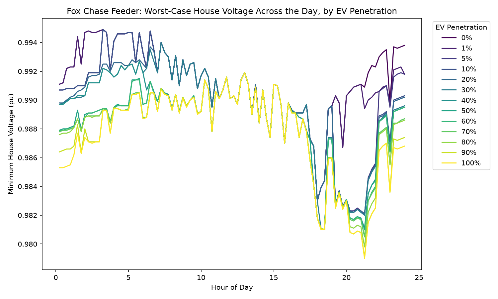

  <h1 align="center">EV Charging Impact Assessment on a Residential Distribution Feeder Using OpenDSS </h3>

  

    A 122 house study measuring the impact of EV adoption on residential feeders and transfomer Loading

---

<!-- ABOUT THE PROJECT -->
## About The Project
This project aims to measure the impact of a EV penetration on a residential distribution feeder. The feeder modeled is a small hypothetical 122 house feeder based in Fox Chase PA outside of Philadelphia. As the data is not public this model does not represent the real layout of the distribution grid of the area but is just a model of what the feeder could hypothetically look like. 

#### Feeder Topology
The layout of our feeder was designed in ArcGIS overalyed on two streets in Fox Chase PA. A reference feeder from NREL's synthetic grid data was used as a reference for designing the feeder. 

#### Modeling Baseline Loads
To get a baseline load for our system with no EV adoption the houses were modeled using NREL's ResStock data. The houses in our model were matched up to a ResStock model of the same type (ie single family detached) and of similar  square footage all located in Philadelphia County, PA. 

#### Modeling EV Loads
To generate randomized EV loads for each house in our study data was pulled from this paper. **Fang, W., Silva-Rodriguez, M., & Li, X. (2025).** _Data-Driven EV Charging Load Profile Estimation and Typical EV Daily Load Dataset Generation._ arXiv:2511.13861. This paper uses real EV charging data to generate load profiles for Electric Vehicles. Specifically all the EV loads in this model are Level 2 (240 V) medium wattage chargers. 

#### Generating DSS files
This script uses Python to generate DSS files for simulation from the exported GIS data. These scripts also are responsbile for assigning each house in the feeder daily load profiles for EV's and house baselines. 

#### Simulating EV adoption
This script generates a different set of EV load files for each of the following EV adoption  [0.00, 0.01, 0.05, 0.1, 0.2, 0.3, 0.4, 0.5, 0.6, 0.7, 0.8, 0.9, 1]. We then simulate our grid for a day measuring the load of each transformer and the voltage quality at each residential load. We can then plot these values over a given time to analyze voltage quality and transformer loading.

Note: Multi Family units are excluded from the study which accounts for ~20 houses. This was a decision made because residents would not be able to have a level 2 charger installed due to the reliance on street parking. 

#### Limitations
The model created in this project is not realistic of how a feeder in this area would look. We can only guess on a lot of the parameters of our distribution systems. Certain simplifications were made throughout this project most notably being that all transformers rated for 50 KVA. In reality there would be mixes of different transformers throughout the feeder. 
The most limiting factor in this model is the size however. This model is only ~120 houses large with only two laterals and two phases (one per street). A real feeder would encompass a much larger area than this. In the future I would like to expand this model to include a larger amount of houses and to properly model distance to substations. 

### Data and Tools
**Geographic / Feeder Topology**

-   Philadelphia Office of Property Assessment (OPA) — parcel data, building classifications, square footage
-   ArcGIS — feeder topology (trunk, laterals, transformer siting, service drop lengths, bus coordinates)

**Household Load Profiles**

-   NREL ResStock End-Use Load Profiles for the U.S. Building Stock — individual building timeseries data, matched by building type and square footage
-   NREL SMART-DS Dataset (Greensboro reference feeder) — conductor specifications and transformer sizing validation

**EV Charging Behavior**

-   Fang, W., Silva-Rodriguez, M., & Li, X. (2025). _Data-Driven EV Charging Load Profile Estimation and Typical EV Daily Load Dataset Generation._ arXiv:2511.13861
-   Associated dataset: _EV Daily Charging Load Profiles Estimations_, Figshare, DOI: 10.6084/m9.figshare.30601655

**Methodological References**

-   Dubey, A., & Santoso, S. (2015). _Electric Vehicle Charging on Residential Distribution Systems: Impacts and Mitigations._ IEEE Access
-   Raffoul & Li (2024/2025) — coincident peak-hour methodology precedent

### Tools & Software

-   **OpenDSS** (EPRI) — distribution system power flow simulation
-   **opendssdirect.py** — Python interface for OpenDSS
-   **Python** — pandas, numpy, matplotlib
-   **ArcGIS** — geographic data processing and feeder mapping

---
# Results
All of the results in this project are taken to be representative of a summer day. The baseline model data is taken from
mid July.
## Transformer Loading
In literature transformer loading is cited as one of the most important factors we must consider when assessing our grid's
readiness to handle the demand of electric vehicles. When pushed to higher than its rated capacity, a transformer
will experience heating which can cause the lifespan of the transformer to decrease. It's for this reason that engineers
try to keep transformer loading to less than 80% of the rated capacity.

The first thing that this model aims to measure is the impact of EV adoption on transformer loading.
From this chart we can see that the average residential transformer loading changes its shape depending on the level of 
EV adoption. We can see that a higher load is being placed on these transformers as we push into the later night and early
morning. This is expected as consumers come home from work at the end of the day and plug in their EV's. This chart
shows that the average transformer isn't being overloaded. I suspect that this is an issue of our models numbers not
being fully representative of the real world. Despite this we still get a good glimpse of how the load shape
changes with EV adoption.

If instead of average transformer loading we look at the peak transformer load over every transformer in the system we can
see that we get localized spikes in transformer loads. We can see that while at 0 EV adoption we get only 1 spike that is of 
concern at around hour 18 with a transformer reaching a load just shy of 90%. Take this in contrast to when we have higher 
EV adoption and we get spikes that are more frequent and longer lasting. Loading such as this will cause the lifespan of these
transformers to decrease.

## Voltage Quality
Voltage quality is another important factor to consider when assessing EV's impact on our distribution grid. Voltage quality
When it comes to EV's as discussed in the literature, the highest impacted part of voltage quality are voltage drops caused
by increased load on the grid.

Graphing the average PU voltage at each residential load we can see the load profile of our EV's impacting the voltage level
at the load. We can see that the average voltage drops to around 0.991 at the peak of EV loading. This however is a negligible
drop compared to the 0.95 maximum drop that ANSI standards require. This highlights another issue with our model only being 
122 houses large, we just dont have the distance and load volume to properly model the voltage quality of our grid.

Even when looking at the worst voltage drops at each time interval we can see that the lowest a drop reaches is 0.98
which is a very negligible drop compared to the 0.95 drop ANSI standards require.

Although the voltage level of our grid stays above ANSI standards we can see that compared to an EV free grid our voltage drops
are more frequent and longer lasting, occurring in the evening and into the night, times when EV charging is most prevalent.

### Conclusion
Our model agrees with the literature in that EV adoption does have a impact on both transfomer loading and voltage quality.
We see higher transformer loads and more frequent voltage drops as EV adoption increases. We cannot however come to many
meaningful conclusions about the magnitude of these effects as our model is just that, a model. This does however highlight 
the importance of initiatives such as smart charging algorithms and time of use pricing inorder to spread out the impact
of EV's over the entire day instead of getting large spikes in the evening. 

---
## Next Steps
In the future I would like to expand this model to include a larger amount of houses and to properly model distances so that 
we can model a true complete feeder. I would also like to include more variance in our model including transformers of 
different sizes. I would also like to vary the EV charging profile to see how the implementation of 
smart chargin alogorithms can help mitigate the impact of EV's.